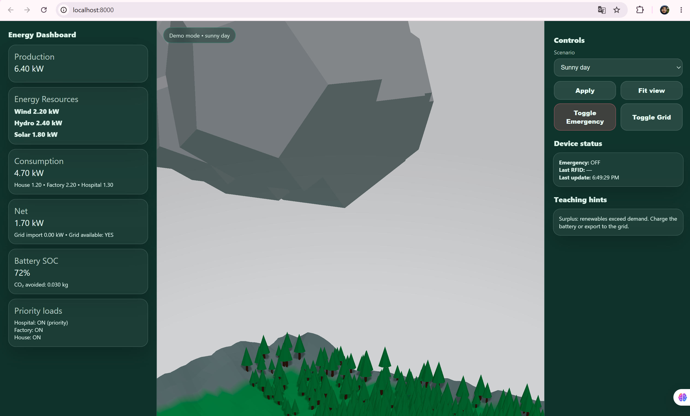
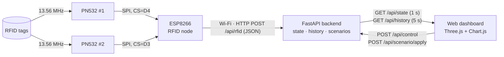

# Energy Demonstrator – Interactive IoT Smart-Grid Demo

A portable and interactive demonstrator that explains how a renewable power grid works: generation, consumption, battery storage, grid import and failures. Physical RFID tags drive a real-time **3D web dashboard**. It was built for schools, public events and expert audiences.

> Team project for the **Internet of Things** course, MSc Communication Engineering, **Carinthia University of Applied Sciences (FH Kärnten)**, 2025/26.
> **My role: RFID subsystem.** I designed the hardware, wrote the ESP8266 firmware and integrated it with the backend ([details below](#my-contribution-rfid-subsystem)).




---

## Architecture



| Layer | Tech | Folder |
|---|---|---|
| Edge / sensing | ESP8266, 2× PN532, C++ (Arduino, PlatformIO) | [`firmware/rfid-node`](firmware/rfid-node) |
| Backend | Python, FastAPI, in-memory time series | [`backend`](backend) |
| Visualisation | Three.js 3D scene, Chart.js, vanilla ES modules | [`backend/static`](backend/static) |
| Tooling | RFID simulator (no hardware needed) | [`tools`](tools) |

## Features

- **3D energy world:** wind, hydro and solar generation; house, factory and hospital loads; animated power flows.
- **Live KPIs:** production and consumption, net balance, grid import, battery state of charge, and CO₂ avoided.
- **Six teaching scenarios:** sunny day, night, wind lull, dry season, peak demand and grid outage.
- **Emergency mode and priority loads:** the hospital stays on and the factory is shed first.
- **Demo mode ↔ live mode:** the dashboard switches to *Live* automatically when telemetry or RFID events arrive from hardware.
- **RFID interaction:** placing a tagged model on a reader sends an event to the backend in real time.

---

## My contribution: RFID subsystem

I owned the physical-interaction layer, from the reader hardware to the backend API.

**Hardware design**
- Two PN532 NFC/RFID readers on a **single shared hardware-SPI bus**, each with its own chip-select line.
- Chip-select pins chosen around the ESP8266 boot-strapping constraints: GPIO15 is avoided, and GPIO0 and GPIO2 are used because they idle HIGH. See [`docs/hardware.md`](docs/hardware.md).

**Firmware** ([`firmware/rfid-node/src/main.cpp`](firmware/rfid-node/src/main.cpp))
- Polls both readers with a bounded timeout, so one reader never blocks the other.
- **Per-reader debouncing:** a tag resting on a reader is reported once, and removal is detected.
- **Self-healing:** a reader that is missing or stops responding is detected and re-initialised automatically.
- Non-blocking Wi-Fi reconnect; events are sent as JSON over HTTP.
- Credentials are kept out of Git (`config.h` is ignored; see `config.example.h`).

**Integration**
- REST contract for RFID events (`POST /api/rfid`, plus the optional `rfid_*` fields on `/api/telemetry`).
- Last RFID event shown in the dashboard's *Device status* panel. The backend switches to *Live mode* on the first event.
- A [simulator](tools/rfid_simulator.py) that sends exactly the same requests as the firmware, for testing and demos without hardware.

---

## Quick start

### 1. Backend and dashboard

```bash
cd backend
python -m venv .venv
# Windows: .venv\Scripts\activate    Linux/macOS: source .venv/bin/activate
pip install -r requirements.txt
uvicorn main:app --host 0.0.0.0 --port 8000
```

Open <http://localhost:8000>. Interactive API docs are at <http://localhost:8000/docs>.

### 2a. Without hardware: simulate RFID events

```bash
python tools/rfid_simulator.py --loop --interval 2
```

### 2b. With hardware: flash the RFID node

1. Wire the readers as shown in [`docs/hardware.md`](docs/hardware.md).
2. Configure the node:
   ```bash
   cd firmware/rfid-node
   cp include/config.example.h include/config.h   # set Wi-Fi and the backend IP
   ```
3. Build, upload and monitor with [PlatformIO](https://platformio.org/):
   ```bash
   pio run -t upload && pio device monitor
   ```

Expected serial output:

```
Energy Demonstrator - RFID node (ESP8266 + 2x PN532)
[reader_1] PN532 firmware 1.6
[reader_2] PN532 firmware 1.6
[reader_1] tag 04A1B2C3D4E580 detected (7-byte UID)
[http] {"tag_uid":"04A1B2C3D4E580","reader_id":"reader_1"} -> 200
```

---

## API reference

| Method | Endpoint | Purpose |
|---|---|---|
| `GET` | `/api/state` | Current snapshot: power values, SOC, grid and emergency flags, CO₂, last RFID event |
| `GET` | `/api/history?seconds=300` | Time series for the charts (10–3600 s) |
| `POST` | `/api/scenario/apply` | `{"scenario": "grid_outage"}` switches the demo scenario |
| `POST` | `/api/control` | `{"set": {"emergency_mode": true}}` for UI toggles and manual overrides |
| `POST` | `/api/telemetry` | Live telemetry from devices (any subset of fields, optional `rfid_tag_uid` / `rfid_reader_id`) |
| `POST` | `/api/rfid` | `{"tag_uid": "04A1B2C3", "reader_id": "reader_1"}` for RFID events |

## Repository structure

```
├── backend/
│   ├── main.py              # FastAPI app: state model, scenarios, REST API
│   ├── requirements.txt
│   └── static/              # 3D dashboard (Three.js, Chart.js, ES modules)
├── firmware/
│   └── rfid-node/           # ESP8266 + 2x PN532 (PlatformIO)
│       ├── include/config.example.h
│       └── src/main.cpp
├── tools/
│   └── rfid_simulator.py    # hardware-free RFID event generator
└── docs/
    └── hardware.md          # BOM, wiring, design notes, troubleshooting
```

## Simplifications

This is an educational demonstrator, not a grid simulator. The energy model uses deliberately simple rules: a fixed battery charge and discharge rate, and a constant grid CO₂ factor of 0.35 kg/kWh. State is kept in memory and resets on restart.

## Team

Developed as a team project at FH Kärnten.

- **Elaheh Bayat**: RFID subsystem (hardware, firmware, integration)
- Other components (3D dashboard, backend energy model) were developed by other members of the project team.

## Author

**Elaheh (Eli) Bayat**, Embedded & IoT Systems Engineer
[LinkedIn](https://www.linkedin.com/in/elaheh-bayat/) · [GitHub](https://github.com/elh-bayat)
