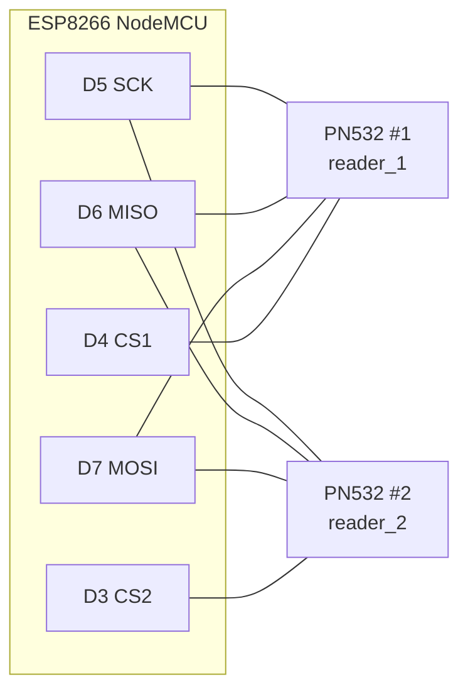

# RFID Node – Hardware & Wiring

## Bill of materials

| Qty | Part | Notes |
|---|---|---|
| 1 | ESP8266 NodeMCU v2 (ESP-12E) | Wi-Fi microcontroller, 3.3 V logic |
| 2 | PN532 NFC/RFID module (13.56 MHz) | ISO 14443A (MIFARE Classic / Ultralight / NTAG) |
| n | ISO 14443A tags / cards / stickers | one tag per demonstrator component |
| – | Jumper wires, USB cable | |

## 1. Put both PN532 boards in SPI mode

Before powering up, set the mode switches on **both** boards:

| Switch 1 | Switch 2 | Interface |
|---|---|---|
| OFF | ON | **SPI** |

## 2. Wiring (shared hardware SPI bus)

Both readers share SCK, MISO and MOSI. Each reader has its own **chip-select (CS/SS)** line, so the ESP8266 talks to one reader at a time.

| PN532 pin | Reader 1 → ESP8266 | Reader 2 → ESP8266 |
|---|---|---|
| VCC | 3V3 | 3V3 |
| GND | GND | GND |
| SCK | D5 / GPIO14 | D5 / GPIO14 |
| MISO | D6 / GPIO12 | D6 / GPIO12 |
| MOSI | D7 / GPIO13 | D7 / GPIO13 |
| SS (CS/NSS) | **D4 / GPIO2** | **D3 / GPIO0** |

## Design notes

- **Hardware SPI** (D5/D6/D7) is used instead of bit-banged SPI for faster, more reliable polling of two readers.
- **D8 / GPIO15 is not used for CS.** It is a boot-strapping pin that must be LOW at boot; a CS line idles HIGH, which would stop the ESP8266 from booting.
- **D3 / GPIO0 and D4 / GPIO2** are also strapping pins, but they must be HIGH at boot. An idle CS line is HIGH, so they are safe for chip select. The firmware drives both CS lines HIGH before `SPI.begin()` so the two modules never drive MISO at the same time.
- **Power:** both PN532 boards run from the 3.3 V rail. Connect every VCC and GND pin on each board for a stable RF field. If reads become unreliable while Wi-Fi transmits, add a 100 µF capacitor across 3V3/GND near the readers.
- **Library:** [Adafruit PN532](https://github.com/adafruit/Adafruit-PN532). The constructor `Adafruit_PN532(ss)` selects hardware SPI with a custom CS pin, so there is one instance per reader.

## Troubleshooting

| Symptom (serial monitor) | Likely cause |
|---|---|
| `PN532 not found` | Mode switches not set to SPI, a loose MISO/SCK wire, or a wrong CS pin |
| ESP8266 does not boot with the readers connected | A CS line is on D8/GPIO15, or D3/D4 is pulled LOW at power-up |
| Tags read on one reader only | That reader's CS wire, or both readers wired to the same CS pin |
| `POST failed: -1` | Wrong `API_HOST`, the backend is not started with `--host 0.0.0.0`, or a firewall is blocking port 8000 |
